# Credit_Risk_Analysis
Employing Machine Learning techniques to assess credit risk

## Overview 

The purpose of the analysis is to evaluate credit risk by using the dataset from LendingClub--
a peer-to-peer lending service. We use machine learning (ML) algorithms to detect risky loans. Credit risk is an unbalanced classification problem because good loans are always more than the risky loans. Hence, we use different resampling methods in situations with unbalanced classes to train and evaluate models. We utilize the scikit-learn and imbalanced-learn libraries in our analysis. We employ two different oversampling techniques: 1) 'Naive Random Oversampling' and 2) 'SMOTE'. We undersample by using the 'Cluster Centroids' method and also use the combination approach--'SMOTEEN'. Finally, we make use of two ensemble methods, namely 'Balanced Random Forest Classifier' and 'Easy Ensemble Classifier',  that are especially useful in unbalanced classes . We then compare the performance of the models with the different techniques.

## Results

* In this analysis there are 68,817 loan applications.
* Credit risk of the applications is divided into and measured by two classes: 1) 'high-risk' and 2) 'low-risk'.
* 68,470 loan applications are classified as low-risk and 347 of them are high-risk.
* From the classification reports we can see that 'low-risk' class is defined as the positive class and the 'high-risk' class is defined as the negative one. 
* Since the purpose of this analysis is to detect fraudulent loans, we are more interested in high-risk, in other words negative class. Hence, majority of our analysis will be based on this class.

* The first resampling technique we use is the Naive Random Oversampling technique which resulted in a balanced accuracy score of 65%, meaning that 65% of the time the data was classified correctly as either low-risk or high-risk.

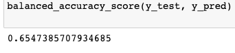

* When we look at the confusion matrix we can see that the number of false positives (high-risk loans but wrongly identified as low-risk) are 28, and the true negatives (correctly identified as high-risk) are 73. 

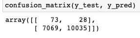

* 7069 loans were falsely identified as high-risk loans (false negatives).
* Thus, the imbalanced classification report that is created depending on the confusion matrix displayed below shows that the precision of the model for the high-risk loans is very low, at 1%.

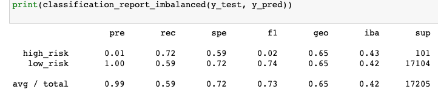

* On the other hand, sensitivity (recall) score of the model for the high-risk loans is 72% indicating that out of all the high-risk loans 72% of them were correctly identified as high-risk, which means 28% of the time a high-risk loan was not detected.
* The F1 score for the high-risk loans is also very low, at 2%. This is expected as there is a large difference between the precision and the recall scores.

* The results of the SMOTE analysis is close the Naive Random Oversampling technique. The balanced accuracy score is 66%.

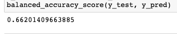

* The number of high-risk loans that were erroneously classified as low-risk are higher with this resampling method--37 false positives and the number of loans correctly indentified as high-risk are less than (64, compared to 73) the random oversampling method.

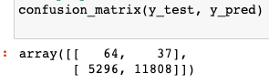

* As a result, the sensitivity/recall of the model is lower compared to the random oversampling technique.

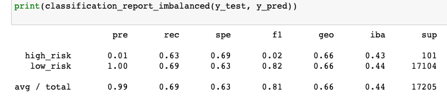

* The precision and F1 scores are the same as the random oversampling method.

* The undersampling method we use is the Cluster Centroids technique. The balanced accuracy score with this method is lower compared to the oversampling methods we have used.

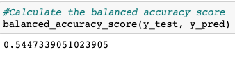 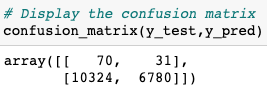

* The precision score for the high-risk loans, in other words correctly identified high-risk loans out of all the loans identified as high-risk, is low (0.01 or 1%) since the number of false negative loans (10,324) greatly outnumbers the true negative ones (70).

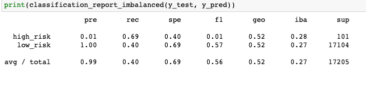

* Even though the recall score is slightly better than the SMOTE method, the F1 score is lower compared to the oversampling techniques.

* We also employed a combinatorial resampling approach of over- and undersampling using SMOTEENN. The results of this method are displayed below.

    

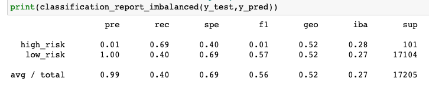

* The results of the SMOTEENN method is the same as the Cluster Centroids method. The balanced accuracy score is low, at 0.54, the precision score is 0.01 and the sensitivity score is 0.69.

* The first ensemble method we used is the Balanced Random Forest Classifier. The results of this ensemble method are displayed below.

                 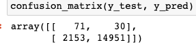

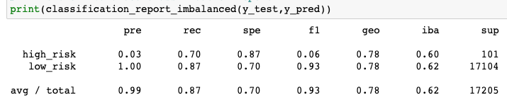

* The balanced accuracy score of the model using this method is 0.78. In other words, 78% of the time the loan applications were correctly classified as high-risk or low-risk. This can also be seen from the confusion matrix since the total number of true positives (correctly identified low-risk loans) and true negatives (correctly identified high-risk loans) is the highest among the methods used so far. 

* The sensitivity score is 0.70 which is slightly lower than the score achieved with random oversampling technique. However, it is higher than SMOTE, Cluster Centroids and SMOTEENN methods.This score indicates that out of all the high-risk loans 70% of them are correctly identified as high-risk. Hence 30% of the risky loans are not detected.

* The precision score and the F1 scores are 0.03 and 0.06 respectively. These are still very low but higher than the ones achieved with all of the methods employed above.

* The final method we use again an ensemble method: Easy Ensemble Classifier (EEC). The balanced accuracy score achieved with this method is the highest so far: 0.93.

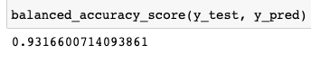

* From the confusion matrix we can see that 93 of the high risk loans were correctly identified as high-risk (true negative). The number of false positives are the lowest (8) in the EEC method. Also, the largest number of true positives (correctly identified low-risk loans) and the lowest number of false negatives (incorrectly identified as high-risk loans but are indeed low-risk loans) are achieved with this method. 

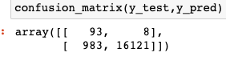

* The sensitivity/recall score is 0.92 which is the highest recall score achieved among all the methods we have employed.
* The precision score is 0.09 which is also the highest. The F1 score is almsot 0.2 (0.16), which is even though low, higher than all the other methods. 

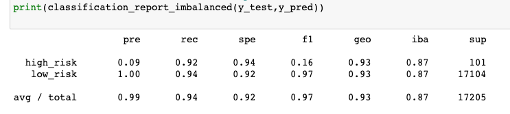

## Summary 

Among the six manchine learning we have employed, the model showed higher performance with the Easy Ensemble method. The accuracy score was the highest (0.93) compared to the other methods. The model was able to correctly classify the loans as low-risk or high-risk 93% of the time. In the EEC method, the number of loans correctly identified as high-risk (93) (true negatives) are the highest while the false positives (8) (wrongly identified as low-risk loans) are the lowest whish is something we would want. Similarly, lowest number of false negatives and highest number of true positives are achieved using the EEC method. These results have direct impact on the recall, precision and F1 scores displayed on the classification report.

The precision, recall and F1 scores were also the highest compared to the other methods. The recall was 0.92 indicating that out of all the high-risk loans, 92% of them were correctly identified as high-risk. This is important because we want to be able to detect the risky loans in order to avoid them. The precision score (0.09) on the other hand, even though it is the highest compared to the ones we  achieved using other techniques, is still very low. One of the reasons for this is the greatly unbalanced dataset we have. There is a huge discrepancy in the number of low-risk loans and the high-risk loans in which the low-risk loans significantly outnumber the high-risk loans. This causes the model to achieve almost 100% precision for low-risk loans while having only 9% precision for the high-risk loans. However, since our aim is to detect high-risk loans and not miss any, having a higher number of false negatives (incorrectly identified as high-risk but actually low-risk) is more preferable to having higher number of false positives (incorrectly identified as low-risk but indeed high-risk). Hence, even though precision is low, high sensitivity/recall is more important in this case and will allow us to identify high-risk loans more effectively.

